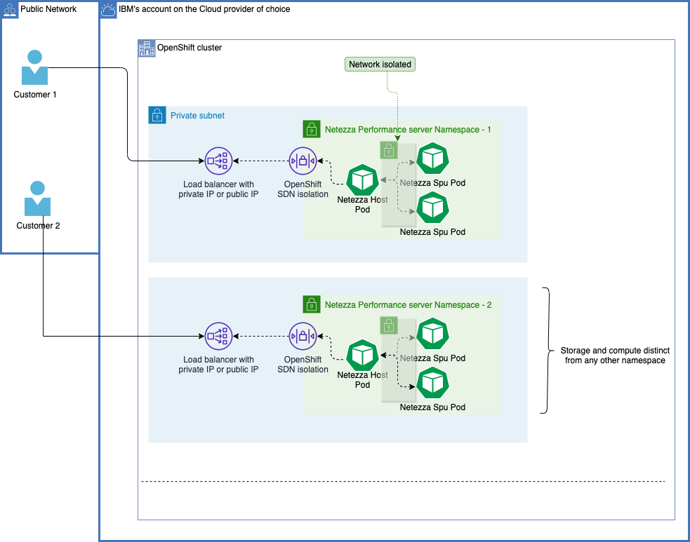

---

copyright:
  years: 2022
lastupdated: "2022-12-09"

keywords: public isolation for Netezza Performance Server, compute isolation for Netezza Performance Server, Netezza Performance Server architecture, workload isolation in Netezza Performance Server

subcollection: netezza

---

{:external: target="_blank" .external}
{:shortdesc: .shortdesc}
{:table: .aria-labeledby="caption"}
{:tip: .tip}
{:important: .important}
{:note: .note}
{:caption: .caption}

# Learning about {{site.data.keyword.netezza_short}} architecture and workload isolation
{: #compute-isolation}

{{site.data.keyword.netezza_full}} uses a multi-tenant-in-a-cluster isolation model. The model uses a separate OpenShift namespace for each customer and each instance.
{: shortdesc}

## {{site.data.keyword.netezza_short}} architecture
{: #architecture}

{: caption="Image 1. The diagram depicts the deployment model and how the workload isolation is ensured." caption-side="bottom"}

## {{site.data.keyword.netezza_short}} workload isolation
{: #workload-isolation}

Customer data and compute storage are isolated from other instances.  Each provisioned instance has a seperate set of worker nodes and separate Cloud Object Storage buckets for customer data. DR Backups are also stored in a customer-specific encrypted Cloud Object Storage bucket.
