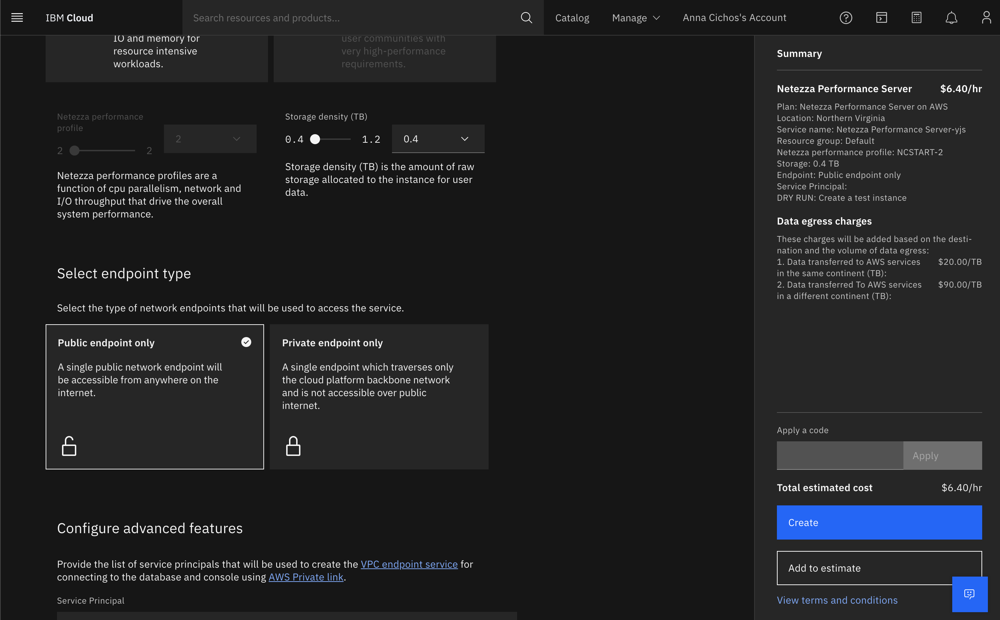

---

copyright:
  years: 2023
lastupdated: "2023-04-20"

keywords: connecting

subcollection: netezza

---
{:external: target="_blank" .external}
{:shortdesc: .shortdesc}
{:codeblock: .codeblock}
{:screen: .screen}
{:tip: .tip}
{:important: .important}
{:note: .note}
{:deprecated: .deprecated}
{:pre: .pre}
{:caption: .caption}

# Connecting to {{site.data.keyword.netezza_short}} on AWS by using private endpoints
{: #connecting-aws}

**DRAFT COMMENT: NEEDS TO BE VERIFIED**

To connect to your {{site.data.keyword.netezza_short}} on AWS by using [AWS PrivateLink](https://docs.aws.amazon.com/vpc/latest/privatelink/what-is-privatelink.html), you must create [private endpoints](https://docs.aws.amazon.com/whitepapers/latest/aws-privatelink/what-are-vpc-endpoints.html) in your AWS subscription.

With these private endpoints, you can connect to the following components:

- Your {{site.data.keyword.netezza_short}} database on port 5480, and the API server on port 443.
- The web console on port 443.

1. Get subscription IDs.

When you create your private endpoint connection, the private link service must approve the request. Your request is approved automatically if you provide the **subscription IDs???? TRUE FOR AWS?** in which they are to be created.

There are two ways in which you can provide the subscription IDs:

- At deployment  
   
   If you deployed your instance with private endpoints only, you must have provided your subscription IDs [during provisioning](/docs/netezza?topic=netezza-getstarted), in step 9. Configure advanced features.

   {: caption="Image 2. Configure advanced features during provisioning." caption-side="bottom"}   

2. Create private endpoints.

Follow the instructions described in [Create a private endpoint](https://docs.aws.amazon.com/vpc/latest/privatelink/create-interface-endpoint.html).  

**DRAFT COMMENT: NEED INPUT**

## Connecting to {{site.data.keyword.netezza_short}}
{: #connecting_instance}

You can access the {{site.data.keyword.netezza_short}} instance by using the two hostnames that you obtained in **2. Create private endpoints.**

- To connect to your {{site.data.keyword.netezza_short}} on port 5480, use the hostname that is associated with the private endpoint that was created with the database resource ID or alias.

- To connect to your {{site.data.keyword.netezza_short}} web console on port 443, you can use the hostname that is associated with the private endpoint that was created with the console resource ID or alias.  

   To form the web console URL from the private endpoint hostname, append the CRN name to it.  
   Example:  
   `https://<private endpoint hostname>/#/?crn=CRN_NAME`  
   To get the CRN name, follow the steps:

   1. Log in to your IBM Cloud account.
   1. Go to **Resource list > Services and software**.
   1. Select your {{site.data.keyword.netezza_short}} instance.  
      The CRN name is displayed on the page.

- To connect to the {{site.data.keyword.netezza_short}} instance from on-prem by using hostnames, you need to setup VPN or Express Route from your on-prem network to the VNET in your subscription.
**DRAFT COMMENT: IS THIS ACCURATE?**

See also:
- Assigning hostnames **ADD LINK**
- [Retrieving information about endpoints for logging in](/docs/netezza?topic=netezza-next-endpoints)
- [Generating credentials](/docs/netezza?topic=netezza-generate-credentials)