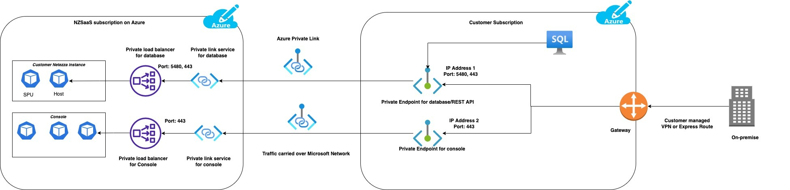
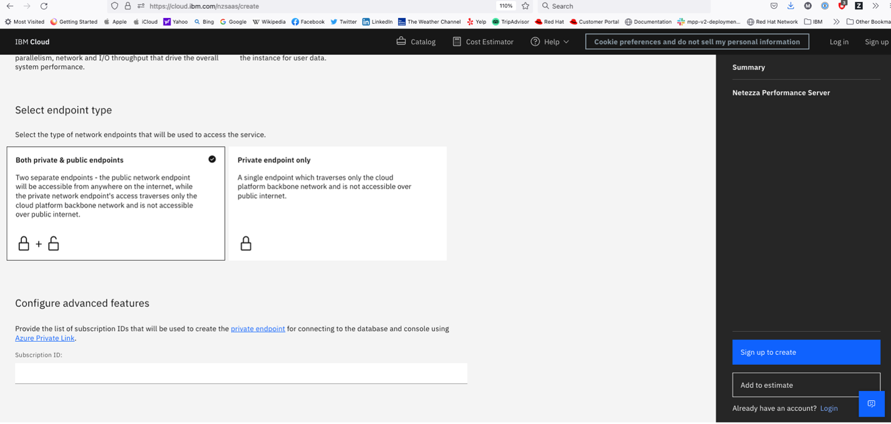

---

copyright:
  years: 2021, 2023
lastupdated: "2023-01-11"

keywords: connecting, private endpoints

subcollection: netezza

---
{:external: target="_blank" .external}
{:shortdesc: .shortdesc}
{:codeblock: .codeblock}
{:screen: .screen}
{:tip: .tip}
{:important: .important}
{:note: .note}
{:deprecated: .deprecated}
{:pre: .pre}
{:caption: .caption}

# Connecting to {{site.data.keyword.netezza_short}} by using private endpoints
{: #connecting-private-endpoints}

If you want to connect to {{site.data.keyword.netezza_short}} by using private endpoints, two [private link services](https://learn.microsoft.com/en-us/azure/private-link/private-link-service-overview) are created.  

To connect to your instance by using these private link services, you must create [private endpoints](https://learn.microsoft.com/en-us/azure/private-link/private-endpoint-overview) in your Azure subscriptions.

With these private endpoints, you can connect to:

- Your {{site.data.keyword.netezza_short}} database on port 5480, and the API server on port 443.
- The web console on port 443.

## Creating private endpoints
{: #create_private_endpoints}

Learn how to create [private endpoints](https://learn.microsoft.com/en-us/azure/private-link/private-endpoint-overview) in your Azure subscriptions.

### 1. Get subscription IDs.
{: #providing-subscription-ids}

When you create your private endpoint connection, the private link service must approve the request. Your request is approved automatically if you provide the subscription IDs in which they are to be created.

There are two ways in which you can provide the subscription IDs:

- At deployment
- In the web console

{: caption="Image 1. Ways to provide subscription IDs." caption-side="bottom"}

#### Providing subscription IDs at deployment
{: #subscription-ids-deployment}

You can provide the subscription IDs as input during provisioning, in the **Configure advanced feature** section.

If you deploy your {{site.data.keyword.netezza_short}} instance with both private and public endpoints, you do not have to provide subscription IDs.
If you deploy only with a private endpoint, you must provide subscription IDs.
{: note}

{: caption="Image 2. The Configure advanced feature section of the IBM Cloud page." caption-side="bottom"}

#### Providing subscription IDs in the web console
{: #subscription-ids-webconsole}

If you deployed your instance with public and private endpoints, log in to the web console by using the public endpoint and set up the private link service on the **Private Link** page.  

1. Go to **Administration > Settings > Private Link** and click **Create Private Link**.
1. Provide the subscription IDs which you want to use to set up the private endpoints in your Azure account.

Use the **Private Link** page to update subscription IDs after private link is created.
{: tip}

### 2. Get resource ID or alias.
{: #getting-resourceid-alias}

You can get the resource ID or alias in one of the following ways:

- By going to **Private endpoints > Service instance details** page for the instance in the IBM Cloud dashboard.
- By going to **Administration > Settings > Private Link** in the web console.

### 3. Create private endpoints.
{: #create_private_link}

Follow the instructions described in [Create a private endpoint](https://learn.microsoft.com/en-us/azure/private-link/create-private-endpoint-portal?tabs=dynamic-ip#create-a-private-endpoint).  

During Step 5, when you are in the _Resource_ pane, select **Connect to an Azure resource by resource ID or alias** and enter the resource ID or alias you retrieved in **2. Get resource ID or alias**.

When the private endpoints are created, the status automatically changes to **Approved**. A private IP is assigned to each of your private endpoints. The IPs are displayed in Microsoft Azure Portal.

## Connecting to {{site.data.keyword.netezza_short}}
{: #connecting_instance}

You can access the {{site.data.keyword.netezza_short}} instance by using the two IP addesses that you obtained in **3. Create private endpoints.**

- To connect to your {{site.data.keyword.netezza_short}} on port 5480, use the IP address that is associated with the private endpoint that was created with the database resource ID or alias.

- To connect to your {{site.data.keyword.netezza_short}} web console on port 443, you can use the IP address that is associated with the private endpoint that was created with the console resource ID or alias.  

   To form the web console URL from the private endpoint IP address, append the CRN name to it.  
   Example:  
   `https://<private endpoint IP>/#/?crn=CRN_NAME`  
   To get the CRN name, follow the steps:

   1. Log in to your IBM Cloud account.
   1. Go to **Resource list > Services and software**.
   1. Select your {{site.data.keyword.netezza_short}} instance.  
      The CRN name is displayed on the page.

- To connect to the {{site.data.keyword.netezza_short}} instance from on-prem by using the IP addresses or hostnames, you need to setup [VPN or Express Route](https://learn.microsoft.com/en-us/azure/architecture/reference-architectures/hybrid-networking/) from your on-prem network to the VNET in your subscription.

## Assigning hostnames
{: #assing_hostnames}

You can assign a hostname to the IP addresses from **3. Create private endpoints.** by following the steps.

1. Log in to the web console.
1. Go to **Administration > Settings > Private link**.
1. Provide the IP address for each of the private endpoints that you created.  
   The hostname or the URLS are displayed on the page now.
1. Assign a hostname.

## Retrieving database and web console details
{: #retrieve_details}

You can retrieve the database and web console URLs by following the steps.

1. Log in to your IBM Cloud account.
1. Go to **Private endpoints > Service instance details**.
1. Select your instance.
