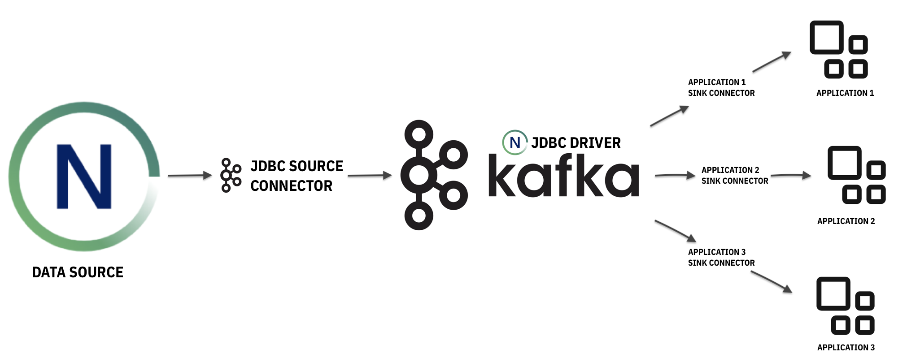
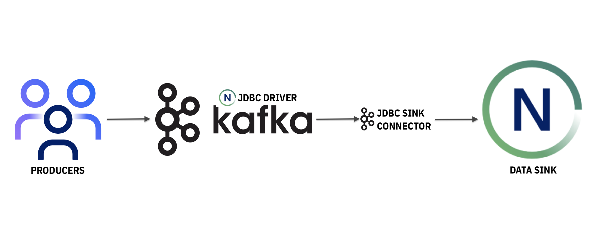

---

copyright:
  years:  2022
lastupdated: "2022-06-20"

keywords:

subcollection: netezza

---

{:new_window: target="_blank"}
{:shortdesc: .shortdesc}
{:screen: .screen}
{:pre: .pre}
{:table: .aria-labeledby="caption"}
{:codeblock: .codeblock}
{:tip: .tip}
{:download: .download}
{:important: .important}
{:caption: .caption}

# {{site.data.keyword.netezza_short}} and Kafka
{: #netezzakafka}

(Apache Kafka)[https://kafka.apache.org/documentation/] is a publish-subscribe messaging system, which you can use to move between popular applications.

After you integrate your {{site.data.keyword.netezza_full}} instance with Kafka through the Kafka JDBC connector, you can use {{site.data.keyword.netezza_short}} as one of the following:

- A data source, which brings data to Kafka.
- A data sink, which reads data from Kafka.

## Use cases
{: #usecaseskafka}

With {{site.data.keyword.netezza_short}} and Kafka, you can do the following tasks:

- Collect metrics
- Collect high-volume events
- Share database change events (change data capture)
- Share last-value queues
- Exchange simple messages

Consider the following examples.

**Example #1**

Data source

An e-commerce company stores its product listings in a {{site.data.keyword.netezza_short}} database. To streamline the in-app search experience and to access real time analytics, consumer apps (for example, Elasticsearch and Apache Flink) have access to the listings.

In this case, data is read from {{site.data.keyword.netezza_short}} through the Kafka JDBC source connector and Kafka streams the data. The consumer apps read from the stream and further process the data.

The following image illustrates the flow.

{: caption="Image 1. The diagram depicts how Kafka reads data from Netezza through the JDBC source connector and enables consumer apps to access it." caption-side="bottom"}

**Example #2**

Data sink

To improve patient outcomes, efficiently identify risk factors, and ensure quicker intervention times, a hospital extracts meaningful insights by analyzing different data sets as they arrive from various channels. The incoming data is streamed and computed through Kafka.

Later on, the processed data is stored on {{site.data.keyword.netezza_short}} through the Kafka JDBC sink connector for patient history record purposes.

{: caption="Image 2. The diagram depicts how incoming data from various producers is streamed and computed by Kafka through the JDBC driver and stored on Netezza." caption-side="bottom"}

In this case,
- the producers = patient data from various channels
- input data is streamed through Kafka and processed before it is being written to Netezza.

## Integrating {{site.data.keyword.netezza_short}} and Kafka
{: #connectingkafka}

If you want to integrate your {{site.data.keyword.netezza_short}} instance with Kafka, you must use the Kafka JDBC connector from (Aiven)[https://github.com/aiven/jdbc-connector-for-apache-kafka].

The Aiven Kafka JDBC connector has support for source and sink JDBC connectors. With the source connector, you can transfer data from a relational database into Kafka topics. With the sink connector, you can transfer data from Kafka topics into a relational database Kafka Connect over JDBC.

### Setting up the JDBC Kafka connector
{:# connectorkafka}

You must install the driver in Kafka's library by editing *plugin.path*. For more information, see
