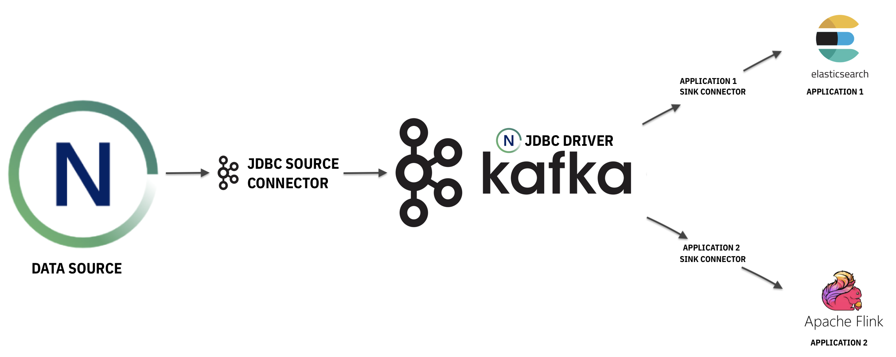

---

copyright:
  years:  2022
lastupdated: "2022-07-07"

keywords: netezza and kafka, integrating kafka with netezza, kafka, netezza as a data sink, netezza as a data source,

subcollection: netezza

---

{:new_window: target="_blank"}
{:shortdesc: .shortdesc}
{:screen: .screen}
{:pre: .pre}
{:table: .aria-labeledby="caption"}
{:codeblock: .codeblock}
{:tip: .tip}
{:download: .download}
{:important: .important}
{:caption: .caption}

# {{site.data.keyword.netezza_short}} and Kafka
{: #netezzakafka}

## Overview
{: #overviewkafka}

[Apache Kafka](https://kafka.apache.org/documentation/) is a publish-subscribe messaging system, which you can use to move data between popular applications.

After you integrate your {{site.data.keyword.netezza_full}} instance with Kafka through the Kafka JDBC connector, you can use {{site.data.keyword.netezza_short}} as one of the following:

- A data source, which brings data to Kafka.
- A data sink, which reads data from Kafka.

## Using {{site.data.keyword.netezza_short}} as a data source
{: #datasourcekafka}

An e-commerce company stores its product listings in a {{site.data.keyword.netezza_short}} database. To streamline the in-app search experience and to access real time analytics, consumer apps (for example, Elasticsearch and Apache Flink) have access to the listings.

In this case, data is read from {{site.data.keyword.netezza_short}} through the Kafka JDBC source connector and Kafka streams the data. The consumer apps read from the stream and further process the data.

The following image illustrates the data flow {{site.data.keyword.netezza_short}} as a data source.

{: caption="Image 1. The diagram depicts how Kafka reads data from Netezza through the JDBC source connector and enables consumer apps to access it." caption-side="bottom"}


## Using {{site.data.keyword.netezza_short}} as a data sink
{: #datasinkkafka}

To improve patient outcomes, efficiently identify risk factors, and provide quicker intervention times, a hospital extracts meaningful insights from physiological data. Different data sets from various channels are analyzed as they arrive.

In this case, the incoming data is streamed through Kafka and then computed. The producers are the sources of physiological data that come from different channels.

After the data is processed, it is stored on {{site.data.keyword.netezza_short}} for patient history record purposes through the Kafka JDBC sink connector.

The following image illustrates the data flow for {{site.data.keyword.netezza_short}} as a data sink.


{: caption="Image 2. The diagram depicts how incoming data from various producers is streamed and computed by Kafka through the JDBC driver and stored on Netezza." caption-side="bottom"}


## Integrating {{site.data.keyword.netezza_short}} and Kafka
{: #connectingkafka}

If you want to integrate your {{site.data.keyword.netezza_short}} instance with Kafka, you must use the Kafka JDBC connector.

The Kafka JDBC connector has support for source and sink JDBC connectors. With the source connector, you can transfer data from {{site.data.keyword.netezza_short}} into Kafka topics. With the sink connector, you can transfer data from Kafka topics into {{site.data.keyword.netezza_short}}by using the Kafka JDBC connector.


### Setting up the JDBC Kafka connector
{: #connectorkafka}

You must install the driver in Kafka's library by editing *plugin.path*.

1. Set up Java.

   For Kafka to work, you need Java 8 or later; for the JDBC connectors, you need Java 11.

   ```ssh
   sudo yum install -y java-11-openjdk-headless
   ```

1. Copy the Netezza JDBC driver to Kafka `libs`

   ```ssh
   cp path/to/nzjdbc3.jar kafka/libs
   ```

1. Set up your connector.

   In the example, the Aiven connector is used.

   a) Download the connector.

   ```ssh
   curl -SLO https://github.com/aiven/jdbc-connector-for-apache-kafka/releases/download/v6.6.2/jdbc-connector-for-apache-kafka-6.6.2.tar

   b) Unpack the package.

   ```ssh
   tar xvf jdbc-connector-for-apache-kafka-6.6.2.tar
   ```

   c) Edit `plugin.path` in Kafka `config/connect-[distributed/standalone].properties` to point to the extracted folder.
   With this, Kafka can find and load the plugin and connector jars.

1. Start the distributed connect.

   ```ssh
   connect-distributed.sh config/connect-distributed.properties
   ```

   Output:

   ```ssh
   [2022-06-29 02:29:43,356] INFO Started o.e.j.s.ServletContextHandler@5562c2c9{/,null,AVAILABLE} (org.eclipse.jetty.server.handler.ContextHandler:915)
   [2022-06-29 02:29:43,356] INFO REST resources initialized; server is started and ready to handle requests (org.apache.kafka.connect.runtime.rest.RestServer:303)
   [2022-06-29 02:29:43,356] INFO Kafka Connect started (org.apache.kafka.connect.runtime.Connect:57)
   ```

1. Register the connectors.

   The database and table must exist on {{site.data.keyword.netezza_short}} before you attempt to register the connectors. 

   - For the source connector, run the following command.

      ```ssh
      curl -s -X POST -H "Content-Type: Application/json" --data '{ "name": "test-source-jdbc", "config": { "connector.class": "io.aiven.connect.jdbc.JdbcSourceConnector", "tasks.max": "1", "connection.url":"jdbc:netezza://localhost:5480/db1;user=user1;password=secret","connection.user":"user1","connection.password":"secret","dialect.name":"GenericDatabaseDialect","topic.prefix":"my","mode": "bulk", "poll.interval.ms":"60000", "table.whitelist":"TEST_TABLE", "batch.max.rows":"10000000" } }' http://localhost:8083/connectors | jq
      {
        "name": "test-source-jdbc",
        "config": {
          "connector.class": "io.aiven.connect.jdbc.JdbcSourceConnector",
          "tasks.max": "1",
          "connection.url": "jdbc:netezza://localhost:5480/db1;user=user1;password=secret,
          "connection.user": ""user1,
          "connection.password": "secret",
          "dialect.name": "GenericDatabaseDialect",
          "topic.prefix": "my",
          "mode": "bulk",
          "poll.interval.ms": "60000",
          "table.whitelist": "TEST_TABLE",
          "batch.max.rows": "10000000",
          "name": "test-source-jdbc"
        },
        "tasks": [],
        "type": "source"
      }
      ```

   - For the sink connector, run the following command.

      ```ssh
      curl -s -X POST -H "Content-Type: Application/json" --data '{ "name": "test-sink", "config": { "connector.class": "io.aiven.connect.jdbc.JdbcSinkConnector", "tasks.max": "2", "connection.url":"jdbc:netezza://localhost:5480/db1;user=user1;password=secret","connection.user":"user1","connection.password":"secret","dialect.name":"GenericDatabaseDialect","topics": "TEST_TABLE", "insert.mode": "insert" } }' http://localhost:8083/connectors | jq
      {
        "name": "test-sink",
        "config": {
          "connector.class": "io.aiven.connect.jdbc.JdbcSinkConnector",
          "tasks.max": "2",
          "connection.url": "jdbc:netezza://localhost:5480/db1;user=user1;password=secret",
          "connection.user": "user1",
          "connection.password": "secret",
          "dialect.name": "GenericDatabaseDialect",
          "topics": "TEST_TABLE",
          "insert.mode": "insert",
          "name": "test-sink"
        },
          "tasks": [],
          "type": "sink"
        }
        ```

1. Verify whether the registration was successful.

   a) List the connectors.

      ```ssh
      curl -s http://localhost:8083/connectors/ | jq
      [
        "test-source-jdbc",
        "test-sink"
      ]
      ```

    b) Check the status of the connectors.

       ```ssh
       curl -s http://localhost:8083/connectors/test-source-jdbc/status | jq
       {
           "name": "test-source-jdbc",
           "connector": {
               "state": "RUNNING",
               "worker_id": "10.11.112.15:8083"
        },
          "tasks": [
            {
                "id": 0,
                "state": "RUNNING",
                "worker_id": "10.11.112.15:8083"
             }
           ],
           "type": "source"
       }
       ```


You can verify whether the connectors work correctly by checking the {{site.data.keyword.netezza_short}} logs.

- For the source connector:

    ```ssh
    2022-06-29 04:13:09.057046 PDT [27743]  DEBUG:  QUERY: SELECT 1
    2022-06-29 04:13:09.061443 PDT [27743]  DEBUG:  QUERY: SELECT * FROM "DB1"."USER1"."TEST_TABLE"
    ANALYZE
    2022-06-29 04:13:09.064209 PDT [27743]  DEBUG:  QUERY: SELECT * FROM "DB1"."USER1"."TEST_TABLE"
    ```
- For the sink connector:

    ```ssh
    2022-06-29 09:08:32.379442 PDT [18976]  DEBUG:  QUERY: CREATE EXTERNAL TABLE bulkETL_18976_0 ( c0 nvarchar(8),c1 nvarchar(10),c2 nvarchar(4),c3 nvarchar(6),c4 nvarchar(7),c5 nvarchar(9),c6 nvarchar(7),c7 nvarchar(9),c8 nvarchar(12),c9 nvarchar(12),c10 nvarchar(25),c11 nvarchar(13),c12 nvarchar(1) )  USING (  DATAOBJECT('/tmp/junk')  REMOTESOURCE 'jdbc'  DELIMITER ' '  ESCAPECHAR '\'  CTRLCHARS 'YES'  CRINSTRING 'YES'  ENCODING 'INTERNAL'  MAXERRORS 1 QUOTEDVALUE 'YES' );
    2022-06-29 09:08:32.525024 PDT [18976]  DEBUG:  QUERY: INSERT INTO "TEST_TABLE"("C1","C2","C3","C4","C5","C6","C7","C8","DATE_PROD","TIME_PROD","TIMESTMP","TIMETZ_PROD","C18") VALUES(bulkETL_18976_0.c0,bulkETL_18976_0.c1,bulkETL_18976_0.c2,bulkETL_18976_0.c3,bulkETL_18976_0.c4,bulkETL_18976_0.c5,bulkETL_18976_0.c6,bulkETL_18976_0.c7,bulkETL_18976_0.c8,bulkETL_18976_0.c9,bulkETL_18976_0.c10,bulkETL_18976_0.c11,bulkETL_18976_0.c12)
    ```
