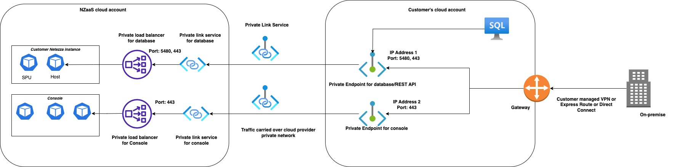
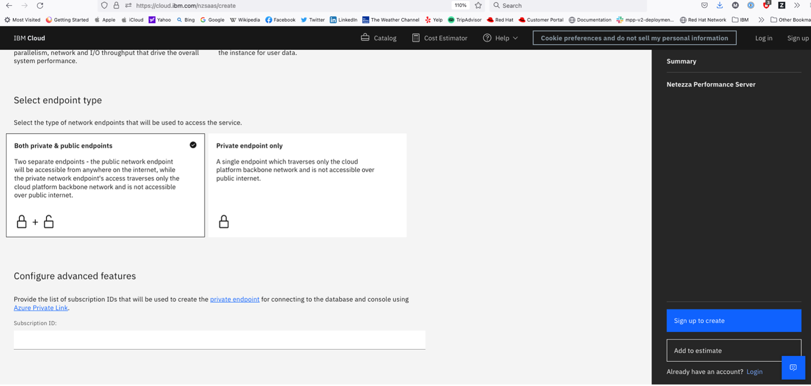

---

copyright:
  years: 2023
lastupdated: "2023-06-01"

keywords: getting started with Netezza Performance Server, provisioning Netezza Performance Server

subcollection: netezza

---

{:shortdesc: .shortdesc}
{:screen: .screen}
{:codeblock: .codeblock}
{:pre: .pre}
{:tip: .tip}
{:note: .note}
{:important: .important}
{:external: target="_blank" .external}
{:step: data-tutorial-type='step'}

# Configuring private endpoints
{: #creating-private-endpoints}

{: caption="Image 1. Connectivity flow from a customer on-premises instance to customer cloud to Private Link to {{site.data.keyword.netezza_short}} as a Service." caption-side="bottom"}

## Configuring private endpoints for Azure
{: #private-endpoints-azure}

If you want to connect to your {{site.data.keyword.netezza_short}} instance on Azure by using [Azure PrivateLink](https://learn.microsoft.com/en-us/azure/private-link/private-link-service-overview), you must create [private endpoints](https://learn.microsoft.com/en-us/azure/private-link/private-endpoint-overview) in your Azure subscriptions.

1. Provide your subscription IDs.

   When you create your private endpoint connection, the private link service must approve the request. If you provide the subscription IDs in which they are to be created, your request is approved automatically.

   - If you deployed your instance with private endpoints only, you provided your subscription IDs [during provisioning](/docs/netezza?topic=netezza-getstarted), in step **9. Configure advanced features**.

   - If you deployed your instance with public and private endpoints and did not provide your subscription IDs during provisioning, log in to the web console by using the public endpoint and set up the private link service.

      1. [Log in to the web console](/docs/netezza?topic=netezza-getstarted-console).
      1. Go to **Administration > Settings > Private endpoints**.
      1. Click **Create Private Link**.
      1. Type the subscription IDs that you want to use to set up the private endpoints in your Azure account.

         Use the **Private Link** page to update subscription IDs after private link is created.
         {: tip}

      {: caption="Image 2. Configure advanced features during provisioning." caption-side="bottom"}

2. Get resource ID or alias.
   You can get the resource ID either from the {{site.data.keyword.netezza_short}} web console or the IBM Cloud catalog.

   - The {{site.data.keyword.netezza_short}} web console:

      1. [Log in to the web console](/docs/netezza?topic=netezza-getstarted-console).
      1. Go to **Administration > Settings > Private endpoints**.
      1. Click **Create Private Link**.

   - The IBM Cloud catalog:

      1. Log in to your IBM Cloud account.
      1. Go to **Private endpoints > Service instance details**.

3. Create private endpoints.
   {: #pvt_ip_address}

   Follow the instructions described in [Create a private endpoint](https://learn.microsoft.com/en-us/azure/private-link/create-private-endpoint-portal?tabs=dynamic-ip#create-a-private-endpoint).

   During Step 5, when you are in the _Resource_ pane, select **Connect to an Azure resource by resource ID or alias** and enter the resource ID or alias you retrieved in **2. Get resource ID or alias**.

   When the private endpoints are created, the status automatically changes to **Approved**. A private IP is assigned to each of your private endpoints. The IPs are displayed in **Microsoft Azure Portal**. Use these details to [log in to your instace by using private endpoints](/docs/netezza?topic=netezza-connecting-overview#private_endpoints).

## Configuring private endpoints for AWS
{: #private-endpoints-aws}

To connect to your {{site.data.keyword.netezza_short}} on AWS by using [AWS PrivateLink](https://docs.aws.amazon.com/vpc/latest/privatelink/what-is-privatelink.html), you must create [private endpoints](https://docs.aws.amazon.com/whitepapers/latest/aws-privatelink/what-are-vpc-endpoints.html) in your AWS subscription.

1. Provide your service principals.

   When you create your private endpoint connection, the private link service must approve the request. Your request is approved automatically if you provide the service principals in which they are to be created.

   - If you deployed your instance with private endpoints, you must have provided your service principals [during provisioning](/docs/netezza?topic=netezza-getstarted), in step **9. Configure advanced features**.

   {: caption="Image 3. Configure advanced features during provisioning." caption-side="bottom"}

2. Create private endpoints.

   Follow the instructions described in [Create a private endpoint](https://docs.aws.amazon.com/vpc/latest/privatelink/create-interface-endpoint.html).

   When the private endpoints are created, a private hostname is assigned to each of your private endpoints. Use these details to [log in to your instace by using private endpoints](/docs/netezza?topic=netezza-connecting-overview#private_endpoints).
