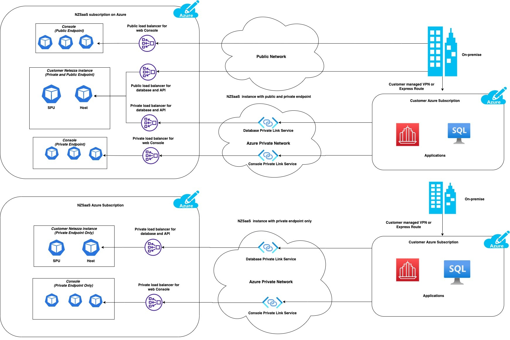

---

copyright:
  years: 2023
lastupdated: "2023-04-24"

keywords: connecting to Netezza Performance Server, connecting, private endpoint, public endpoint, public and private endpoints, web console,

subcollection: netezza

---

{:shortdesc: .shortdesc}
{:screen: .screen}  
{:codeblock: .codeblock}  
{:pre: .pre}
{:tip: .tip}
{:note: .note}
{:external: target="_blank" .external}
{:step: data-tutorial-type='step'}

# Connecting to {{site.data.keyword.netezza_short}}
{: #connecting-overview}

You can connect command-line interfaces, IBM or third-party applications and tools or apps that you create to your {{site.data.keyword.netezza_full}} instance by using private or public endpoints. When you provisioned {{site.data.keyword.netezza_short}}, you selected the type of network that would be used to access the service.  

For Azure, you could have selected both private and public endpoints or private endpoints only. 

For AWS, you could have selected private or public endpoints.

Each endpoint type provides a set of IP addresses or hostnames that you can use to log in to {{site.data.keyword.netezza_short}} by using the following components: 

- **The {{site.data.keyword.netezza_short}} web console**  
   The web interface, which you can log in to on port 443, and use to manage and monitor your instace.  
   See [Getting started with the web console](/docs/netezza?topic=netezza-getstarted-console).

- **The {{site.data.keyword.netezza_short}} software clients**  
   The CLI clients that you can use to connect to the database on port 5480, and use to manage and monitor your instace.  
   See [Client packages](https://www.ibm.com/docs/en/netezza?topic=npsda-installing-client-software-packages-2).

   {: caption="Image 1. Ways to connect." caption-side="bottom"}

## Connecting by using public endpoints
{: #public_endpoints}

A public endpoint can be accessed over the public network or internet. You can connect to your application by using a public hostname.  

To log in to your instance by using public endpoints, you need public hostname details. To get the details, follow these steps:

1. Log in to the IBM Cloud catalog.
1. Go to **Resource list > Services and Software**.
1. Click on your {{site.data.keyword.netezza_short}} instance.  
   You are now on the **Service instance details** page where you can find information about endpoints for accessing the web console, the API server, and the database. 
1. Use your instance credentials to [log in on port 443 by using the web console](/docs/netezza?topic=netezza-getstarted-console) or [log in on port 5480 by using the {{site.data.keyword.netezza_short}} clients](https://www.ibm.com/docs/en/netezza?topic=npsda-installing-client-software-packages-2).
   
   To view your credentials, follow these steps.

   1. In the IBM Cloud catalog, go to **Service credentials**.
   1. Expand **View credentials**.
      Use the password to connect to the {{site.data.keyword.netezza_short}} database and web console as user admin.

      See [Adding credentials](LINK).

Access to your data is protected by strong authentication, vast {{site.data.keyword.netezza_short}} authorization options and access controls, encryption over the wire by using SSL and at rest, and IBM security and compliance practices for development and operations.

## Connecting by using private endpoints
{: #private_endpoints} 

A private endpoint offers you a way to connect over the cloud platform internal network and is not accessible from public networks.

For Azure, {{site.data.keyword.netezza_short}} supports private connectivity through [Azure Privatelink](https://azure.microsoft.com/en-us/pricing/details/private-link/#overview).  

For AWS, {{site.data.keyword.netezza_short}} supports private connectivity through [AWS PrivateLink](https://docs.aws.amazon.com/vpc/latest/privatelink/what-is-privatelink.html).  

1. Log in to the IBM Cloud catalog.
1. Go to **Resource list > Services and Software**.
1. Click on your {{site.data.keyword.netezza_short}} instance.  
   You are now on the **Service instance details** page where you can find information about endpoints for accessing the web console, the API server, and the database.
1. Use your instance credentials to [log in on port 443 by using the web console](/docs/netezza?topic=netezza-getstarted-console) or [log in on port 5480 by using the {{site.data.keyword.netezza_short}} clients](https://www.ibm.com/docs/en/netezza?topic=npsda-installing-client-software-packages-2).
   
   To form the web console URL from the private endpoint IP address, append the CRN name to it. These details are in **Resource list > Services and software > Service instance details**.

   Example:  
   `https://<private endpoint IP>/#/?crn=CRN_NAME`  

To connect to the {{site.data.keyword.netezza_short}} instance from on-prem by using the IP addresses or hostnames, you need to setup [VPN or Express Route](https://learn.microsoft.com/en-us/azure/architecture/reference-architectures/hybrid-networking/) from your on-prem network to the VNET in your subscription.

## Viewing endpoints
{: #view-endpoints}

1. Log in to your IBM Cloud account.
1. Go to Resource list > Services and software.
1. Select your Netezza Performance Server instance.
   You are now on the service instance page.
1. Click the Manage tab.
   You can now access information about your endpoints.
   