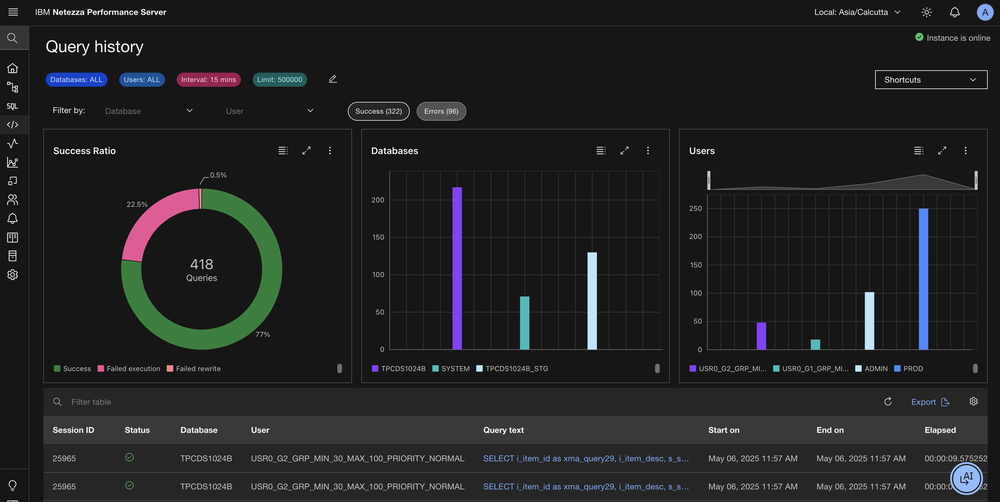
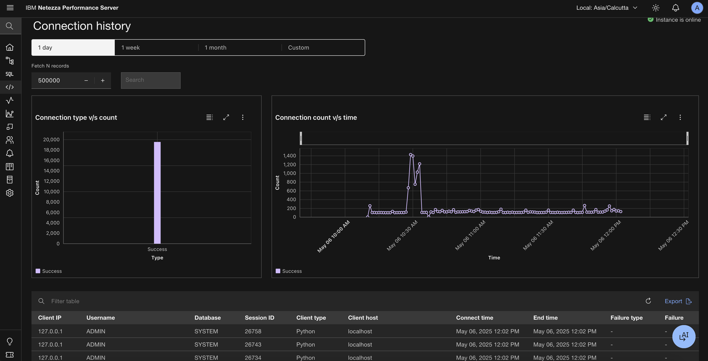

---

copyright:
  years: 2025
lastupdated: "2025-04-30"

keywords: web console, queries

subcollection: netezza

---

{:external: target="_blank" .external}
{:shortdesc: .shortdesc}
{:table: .aria-labeledby="caption"}
{:tip: .tip}
{:important: .important}
{:note: .note}
{:screen: .screen}

# History
{: #history}

## Query history
{: #query_history}

The administrator privileges are not necessary to view query history. The **Query history** view is only showing SQL statements that involve the generation of a query plan, for example, INSERT, UPDATE, DELETE, or SELECT statements.

The Query History can be filtered by selecting from various preset intervals or specifying a custom time interval.

### Visual insights
{: #queryhistory_chart}

- Success Ratio: Represents the ratio of queries executed within the selected time span. This metric calculates the total number of queries fired against the number of completed and failed queries (with varying failure reasons).
- Databases: Displays the total number of queries fired on the databases during the selected time span.
- Users:

   - For Admin users: Displays the total number of queries fired by all users within the selected time span.
   - For Non-admin users: Shows the total number of queries fired by the individual user within the selected time span.

The system supports up to 500,000 rows, with a minimum fetch of 2,000 rows via the API. A numeric input option will allow setting a limit for data retrieval.
{: note}

### Creating queries
{: #create-queries}

1. Go to **Query editor**.
1. Type a name for your query.
1. Select the database in which you want to run the query.
1. Select the schema where you want to run the query.

   If you do not pick a schema, the default database schema is selected.

1. Type the SQL query that you want to run.

   If your query is a select statement, a *Set Limit* option appears to allow you to specify how many rows of data you want to retrieve. The default is `No limit`.

1. When you add the necessary information, you can do one of the following:

   - Click **Run** to run the query.

     The results of the query are displayed in the panel.

   - Click the floppy disk icon that is next to the `Query field` name to save the query as a template.

     The saved query is added to **Queries > Recent Queries**.

   - Click **Clear** to clear the query.

### Finding queries
{: #find-queries}

1. Go to **Queries > Recent queries**.
1. Type the name of the query you are looking for in the search bar.

## Query cancellation
{: #query-cancellation}

When you execute a long running query from query editor, you can cancel the query until the time it is in execution by a simple click of the button.

## Connection history
{: #connection-hist}

The Connection history page provides a comprehensive view of all connection requests made to the system over a period of time. This feature allows you to track and analyze connection attempts made by different users through various drivers or connectors.

- Connection request overview: View a detailed list of all connection attempts, including successful connections and erroneous connections, which comprise connection failures and authentication failures. This information is helpful in auditing the system for connections, allowing administrators to monitor and troubleshoot connectivity issues.

- Visual insights: Two interactive graphs provide a clear picture of connection attempts:

   - Connection status graph: Displays the count of successful connections, authentication failures, and connection failures.

   - Time-based graph: Shows the distribution of connection attempts over time, helping you identify trends and patterns.

  

## Automaint history
{: #automain_hist}

The Automaint history page provides a record of the last successful scheduled automaint run within the current automaint window. This page offers two sections: **Genstats** and **Grooms**.

**Genstats**: This section provides a list of tables used to generate statistics, helping to improve system performance by identifying areas for optimization.

**Grooms**: This section displays information about the maintenance activities performed during the last scheduled automaint run, including information like:

- Number of records purged.
- List of pages that were made available or updated during the groom.

 
